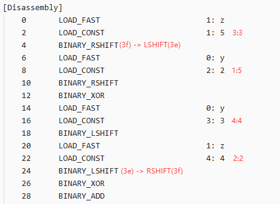

## 0x10 工具概览

### 1.`PyInstaller`
一个把 Python 脚本打包成独立可执行文件（EXE 或 Linux 可执行文件）的工具，它可以将 Python 解释器和所有依赖打包在一起，用户无需安装 Python 就能运行你的程序

PyInstaller 打包的程序通常有两种结构：

1. **单文件模式（`--onefile`）**
    
    - 可执行文件是自解压的，运行时会把 `.pyc` 等文件解压到临时目录
        
    - 文件直接嵌入 exe 内部
        
2. **单目录模式（`--onedir`）**
    
    - 可执行文件在目录下，里面已经有 `.pyc`、DLL、资源等文件。


### 2.`pyinstxtractor.py` 
一个 Python 脚本， PyInstaller 解包工具

```
python pyinstxtractor.py main.exe
```

会生成一个以 `main.exe_extracted`命名的文件夹
文件夹里包含：

- `PYZ-00.pyz` → 压缩包，里面是 `.pyc` 文件
    
- 资源文件（图片、配置等）
    
- 动态库 `.dll` 或 `.so`


### 3.`pycdc`和`pycdas`

`pycdc`  :将 Python `.pyc` 字节码文件反编译回 Python 源代码
`pycdas` :分析字节码结构

| 语言     | 编译产物            | 逆向方式         |
| ------ | --------------- | ------------ |
| Python | `.pyc`          | `dis` / 反编译  |
| Java   | `.class`        | `javap`      |
| C/C++  | `.exe/.dll/.so` | IDA / Ghidra |
| 混合     | `.pyd`          | **当 C 逆**    |

| `.pyc` 文件结构          |
| -------------------- |
| 魔数 (Magic Number) 4B |
| 时间戳或哈希 4B/8B         |
| 字节码内容 (Code Objects) |

## 0x20 逆向流程
(conda 进入py39的环境下)
- main.py  (源码)  
   │  
   ▼ (Python 编译)  
   │  
- main.pyc (字节码)  
   │  
   ▼ (PyInstaller打包)  
   │  
- main.exe (可执行程序)

文件`main.exe`是通过python 编译后生成的.pyc文件打包形成的  

`main.exe` 里面包含：

- Python 解释器（嵌入式）
    
- 你的 `.pyc` 字节码文件（通常压缩在 exe 内部）
    
- 所需的依赖库和资源文件

所以需要用`PyInstaller`对``main.exe``进行解包，然后再通过反编译工具将.pyc文件还原成.py文件分析整个源码的流程

### 1.`pyinstxtractor.py` 解包

```
python pyinstxtractor.py main.exe
```

生成 `main.exe_extracted` 文件夹


关键文件：
- `main.pyc` - 主程序
- `myalgo.pyc` - 加密算法模块
- `crypto.pyc` - 加密工具库（包含魔改的 `a85decode`）

### 2. `pycdc` 反编译

```
pycdc ./main.pyc > ./main.py
pycdc ./myalgo.pyc > ./myalgo.py
pycdc ./crypto.pyc > ./crypto.py
```
如果`pycdc`输出不完整的通过`pycdas`输出字节码手工分析

分析结果如下：  
**main.py**

```python
import struct
from crypto import *
from sys import *
import base64
import myalgo
welcome_msg = 'V2VsYzBtMyBUbyBUaGUgV29ybGQgb2YgTDFsYWMgPDM='
input_msg = ':i(G#8T&KiF<F_)F`JToCggs;'
right_msg = 'UmlnaHQsIGNvbmdyYXR1bGF0aW9ucyE='
wrong_msg = 'V3JvbmcgRmxhZyE='
print(b64decode(welcome_msg).decode())
flag = input(a85decode(input_msg).decode())
if not flag.startswith('LilacCTF{') and flag.endswith('}') or len(flag) == 26:
    print(b64decode(wrong_msg).decode())
else:
    flag = flag[9:25]
    res = [
        761104570,
        1033127419,
        0xDE446C05,
        795718415]
    key = struct.unpack('<IIII', b'1111222233334444')
    input = list(struct.unpack('<IIII', flag.encode()))
    myalgo.btea(input, 4, key)
    if input[0] == res[0] and input[1] == res[1] and input[2] == res[2] and input[3] == res[3]:
        print(b64decode(right_msg).decode())
    else:
        print(b64decode(wrong_msg).decode())
```


**myalgo.py**

```python
import dis
import struct

def MX(y, z, sum, k, p, e):
    return (z >> 5 ^ y >> 2) + (y << 3 ^ z << 4) ^ (sum ^ y) + (k[p & 3 ^ e] ^ z)


def btea(v, n, k):
    
    u32 = lambda x: x & 0xFFFFFFFF
    y = v[0]
    sum = 0
    DELTA = 1163219540
    if n > 1:
        z = v[n - 1]
        q = 6 + 52 // n
        if q > 0:
            q -= 1
            sum = u32(sum + DELTA)
            e = u32(sum >> 2) & 3
            p = 0
            if p < n - 1:
                y = v[p + 1]
                z = v[p] = u32(v[p] + MX(y, z, sum, k, p, e))
                p += 1
                continue
            y = v[0]
            z = v[n - 1] = u32(v[n - 1] + MX(y, z, sum, k, p, e))
            continue
        return True

if __name__ == '__main__':
    print('WOW')


```

**XXTEA加密算法** `(btea)`
但 **DELTA 被改了**：
`标准: 0x9E3779B9 这里: 0x45555554`

加密：v[p] = v[p] + MX(...)
解密：v[p] = v[p] - MX(...)

其中MX()对应字节码为：
```
[Code]
            File Name: myalgo.py
            Object Name: MX
            Arg Count: 6
            Pos Only Arg Count: 0
            KW Only Arg Count: 0
            Locals: 6
            Stack Size: 5
            Flags: 0x00000043 (CO_OPTIMIZED | CO_NEWLOCALS | CO_NOFREE)
            [Names]
            [Var Names]
                'y'
                'z'
                'sum'
                'k'
                'p'
                'e'
            [Free Vars]
            [Cell Vars]
            [Constants]
                None
                5
                2
                3
                4
            [Disassembly]
                0       LOAD_FAST                       1: z
                2       LOAD_CONST                      1: 5
                4       BINARY_RSHIFT                   
                6       LOAD_FAST                       0: y
                8       LOAD_CONST                      2: 2
                10      BINARY_RSHIFT                   
                12      BINARY_XOR                      
                14      LOAD_FAST                       0: y
                16      LOAD_CONST                      3: 3
                18      BINARY_LSHIFT                   
                20      LOAD_FAST                       1: z
                22      LOAD_CONST                      4: 4
                24      BINARY_LSHIFT                   
                26      BINARY_XOR                      
                28      BINARY_ADD                      
                30      LOAD_FAST                       2: sum
                32      LOAD_FAST                       0: y
                34      BINARY_XOR                      
                36      LOAD_FAST                       3: k
                38      LOAD_FAST                       4: p
                40      LOAD_CONST                      3: 3
                42      BINARY_AND                      
                44      LOAD_FAST                       5: e
                46      BINARY_XOR                      
                48      BINARY_SUBSCR                   
                50      LOAD_FAST                       1: z
                52      BINARY_XOR                      
                54      BINARY_ADD                      
                56      BINARY_XOR                      
                58      RETURN_VALUE                    
        'MX'
    
```

Var Names表示形参变量（从0开始对应）

| 0   | 1   | 2   | 3   | 4   | 5   |
| --- | --- | --- | --- | --- | --- |
| y   | z   | sum | k   | p   | e   |

Constants表示常量

| 0    | 1   | 2   | 3   | 4   |
| ---- | --- | --- | --- | --- |
| none | 5   | 2   | 3   | 4   |


操作数1 LOAD_FAST（2B）:表示对应的形参  
操作数2 LOAD_CONST （2B）:表示对应的常量  
操作码 (2B)

| 操作码               | Hex    | ASCII |
| ----------------- | ------ | ----- |
| `BINARY_AND`      | `0x40` | `@`   |
| `BINARY_XOR`      | `0x41` | `A`   |
| `BINARY_OR`       | `0x42` | `B`   |
| `BINARY_LSHIFT`   | `0x3e` | `>`   |
| `BINARY_RSHIFT`   | `0x3f` | `?`   |
| `BINARY_ADD`      | `0x17` | 非打印   |
| `BINARY_SUBTRACT` | `0x18` | 非打印   |
| `BINARY_MULTIPLY` | `0x14` | 非打印   |
| `BINARY_SUBSCR`   | `0x19` | 非打印   |
| `STORE_SUBSCR`    | `0x3c` | `<`   |

 **crypto.py**
 内置有很多函数，但其中关键函数（被使用到的）`a85decode()`和`b64decode()`显示 `WARNING: Decompyle incomplete`，所以需要pycdas输出字节码手工分析
```
pycdas ./crypto.py ./crypto.txt
```

**crypto.a85decode()**
```python
import struct
from types import CodeType

def a85decode(b, *, foldspaces=False, adobe=False, ignorechars=b" \t\n\r\x0b"):
    # --- Step 1: 转成 bytes ---
    b = _bytes_from_decode_data(b)

    # --- Step 2: 处理 Adobe Ascii85 包裹符 ---
    if adobe:
        if not b.endswith(_A85END):
            raise ValueError("Ascii85 encoded byte sequences must end with {!r}".format(_A85END))
        if b.startswith(_A85START):
            b = b[2:-2]
        else:
            b = b[:-2]

    packI = struct.Struct('!I').pack
    decoded = []
    curr = []

    # --- Step 3: 主 Ascii85 解码循环 ---
    for x in b + b'uuuu':  # padding trick
        if 33 <= x <= 117:  # 有效 Ascii85 字符
            curr.append(x)
            if len(curr) == 5:
                acc = 0
                for c in curr:
                    acc = acc * 85 + (c - 33)
                try:
                    decoded.append(packI(acc))
                except struct.error:
                    raise ValueError("Ascii85 overflow")
                curr.clear()
        elif x == ord('z'):  # z = 4 个 0
            if curr:
                raise ValueError("z inside Ascii85 5-tuple")
            decoded.append(b'\x00\x00\x00\x00')
        elif foldspaces and x == ord('y'):  # y = 4 spaces
            if curr:
                raise ValueError("y inside Ascii85 5-tuple")
            decoded.append(b'    ')
        elif x in ignorechars:
            continue
        else:
            raise ValueError("Non-Ascii85 digit found: %c" % x)

    # --- Step 4: 这里开始是恶意/隐藏逻辑 ---
    # 取出 MX 函数原始字节码
    payload = MX.__code__.co_code

    magic_code1 = b'?'
    magic_code2 = b'>'

    # 对字节码做拼接重排（混淆/隐藏真正逻辑）
    payload = (
        payload[:4] + magic_code2 +
        payload[5:10] + magic_code1 +
        payload[11:18] + magic_code2 +
        payload[19:24] + magic_code1 +
        payload[25:]
    )

    payload = (
        payload[:3] + b'\x03' +
        payload[4:9] + b'\x01' +
        payload[10:17] + b'\x04' +
        payload[18:23] + b'\x02' +
        payload[24:]
    )

    # --- Step 5: 动态重建 MX 函数的 code object ---
    fn_code = MX.__code__

    MX.__code__ = CodeType(
        int(fn_code.co_argcount),
        int(fn_code.co_posonlyargcount),
        int(fn_code.co_kwonlyargcount),
        int(fn_code.co_nlocals),
        int(fn_code.co_stacksize),
        int(fn_code.co_flags),
        payload,                   # 替换后的字节码
        fn_code.co_consts,
        fn_code.co_names,
        fn_code.co_varnames,
        fn_code.co_filename,
        fn_code.co_name,
        int(fn_code.co_firstlineno),
        fn_code.co_lnotab,
        fn_code.co_freevars,
        fn_code.co_cellvars
    )

    # --- Step 6: 正常返回 Ascii85 解码结果 ---
    result = b''.join(decoded)
    padding = 4 - len(curr)
    if padding:
        result = result[:-padding]

    return result

```

`从中可以看出MX()字节码被修改 （加密算法被改了）`


MX()被修改为:
```python
def MX(y, z, sum, k, p, e):
    return (z << 3 ^ y >> 5) + (y << 4 ^ z >> 2) ^ (sum ^ y) + (k[p & 3 ^ e] ^ z)
```


**b64decode()**
```python
import re
import binascii

def b64decode(s, altchars=None, validate=False):
    """
    Decode the Base64 encoded bytes-like object or ASCII string s.

    Optional altchars must be a bytes-like object or ASCII string of length 2
    which specifies the alternative alphabet used instead of the '+' and '/'
    characters.

    The result is returned as a bytes object. A binascii.Error is raised if
    s is incorrectly padded.

    If validate is False (the default), characters that are neither in the
    normal base-64 alphabet nor the alternative alphabet are discarded prior
    to the padding check. If validate is True, these non-alphabet characters
    in the input result in a binascii.Error.
    """

    # 转成 bytes
    s = _bytes_from_decode_data(s)

    # 处理自定义 alphabet
    if altchars is not None:
        altchars = _bytes_from_decode_data(altchars)
        if len(altchars) != 2:
            raise AssertionError(repr(altchars))

        # 把自定义字符替换回标准 '+/'
        s = s.translate(bytes.maketrans(altchars, b'+/'))

    # 严格校验模式
    if validate:
        if not re.fullmatch(b'[A-Za-z0-9+/]*={0,2}', s):
            raise binascii.Error('Non-base64 digit found')

    # 真正解码
    return binascii.a2b_base64(s)

```


### 3.整体加密流程

密文数据  
   ↓  
Base85 解码 (a85decode)  
   ↓  
zlib 解压  
   ↓  
marshal.loads  →  得到 code object  
   ↓  
替换 MX.code  
   ↓  
MX() 变成真正的“加密/校验函数”

### 4.解密代码
```python
import dis
import struct

def MX(y, z, sum, k, p, e):
    return (z << 3 ^ y >> 5) + (y << 4 ^ z >> 2) ^ (sum ^ y) + (k[p & 3 ^ e] ^ z)

def btea_encrypt(v, n, k):
    """加密函数"""
    u32 = lambda x: x & 0xFFFFFFFF
    if n < 2:
        return False
    
    y = v[0]
    sum = 0
    DELTA = 1163219540
    q = 6 + 52 // n
    
    for _ in range(q):
        sum = u32(sum + DELTA)
        e = u32(sum >> 2) & 3
        
        for p in range(n - 1):
            z = v[p + 1]
            y = v[p] = u32(v[p] + MX(y, z, sum, k, p, e))
        
        z = v[0]
        y = v[n - 1] = u32(v[n - 1] + MX(y, z, sum, k, n - 1, e))
    
    return True

def btea_decrypt(v, n, k):
    """解密函数 - 加密的逆过程"""
    u32 = lambda x: x & 0xFFFFFFFF
    if n < 2:
        return False
    
    y = v[0]
    sum = 0
    DELTA = 1163219540
    q = 6 + 52 // n
    
    # 计算总的sum值
    sum = u32(q * DELTA)
    
    for _ in range(q):
        e = u32(sum >> 2) & 3
        
        # 反向遍历数组
        for p in range(n - 1, 0, -1):
            z = v[p - 1]
            y = v[p] = u32(v[p] - MX(y, z, sum, k, p, e))
        
        # 处理最后一个元素
        z = v[n - 1]
        y = v[0] = u32(v[0] - MX(y, z, sum, k, 0, e))
        
        sum = u32(sum - DELTA)
    
    return True

# 测试加密解密
def test_btea():
    # 测试数据
    v =  [
        761104570,
        1033127419,
        0xDE446C05,
        795718415]
    original_v = v[:]  # 备份原始数据
    k = struct.unpack('<IIII', b'1111222233334444')
    n = len(v)
    
    # 解密
    if btea_decrypt(v, n, k):
        flag = struct.pack('<IIII', *v).decode('utf-8')
        print("解密后数据:", flag)
        print("解密成功:", v == original_v)

# 如果需要完整的加密函数（修复了原代码中的循环问题）
def btea(v, n, k):
    """完整的加密函数（修复了原代码中的循环问题）"""
    u32 = lambda x: x & 0xFFFFFFFF
    if n < 2:
        return False
    
    y = v[0]
    sum = 0
    DELTA = 1163219540
    q = 6 + 52 // n
    
    for _ in range(q):
        sum = u32(sum + DELTA)
        e = u32(sum >> 2) & 3
        
        for p in range(n - 1):
            z = v[p + 1]
            y = v[p] = u32(v[p] + MX(y, z, sum, k, p, e))
        
        z = v[0]
        y = v[n - 1] = u32(v[n - 1] + MX(y, z, sum, k, n - 1, e))
    
    return True

if __name__ == "__main__":
    test_btea()
```

```
Flag: LilacCTF{e@sy_Pyth0n_SMC!}
```


## 0x30 参考链接

[https://blog.xmcve.com/2026/01/27/LilacCTF-2026-Writeup](https://blog.xmcve.com/2026/01/27/LilacCTF-2026-Writeup/#title-4)

> [!NOTE]
> 注：EZpython的`5. 还原修补后的 MX 函数` 操作符(位置10) 操作符(位置18)位置修改有问题，应该是操作符(位置4) 和操作符(位置24)