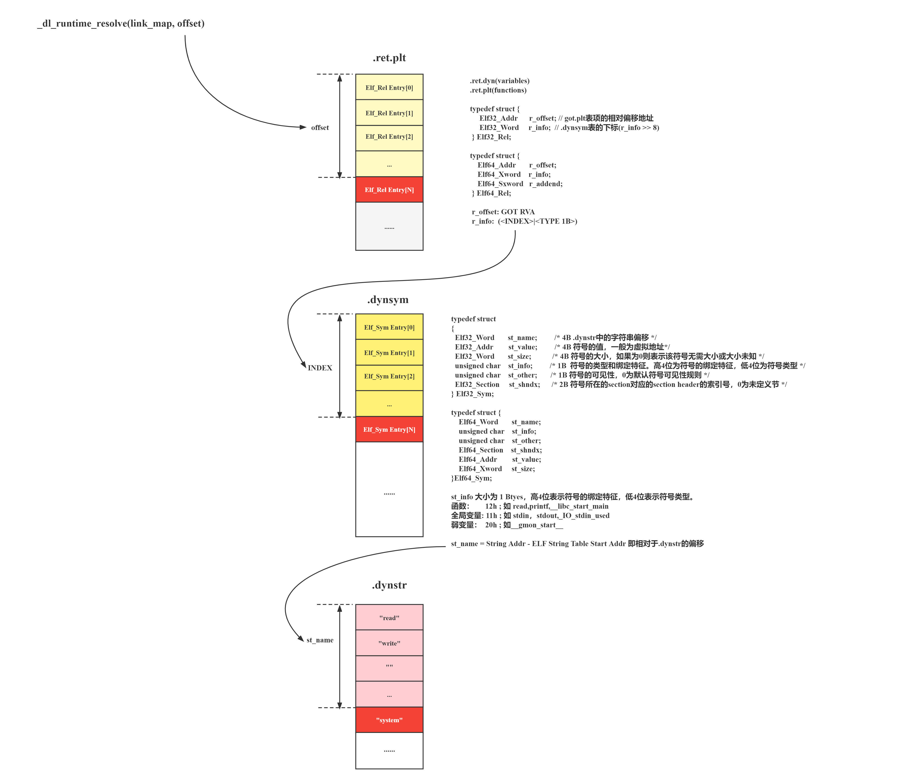

## 0x10 前置知识

**x86-64** 

### 1 .rela.plt

```
Elf64_Rela {
   0x00    8     r_offset →重定位生效的地址
	0x08    8     r_info →符号索引 + 重定位类型
	0x10    8     r_addend 
}
total = 0x18 (24 bytes)  
```

#### r_info 

| 63- 32    | 31 - 0   |
| --------- | -------- |
| sym index | rel type |

#### rel type 
R_X86_64_JUMP_SLOT 7 (PLT/GOT 延迟绑定)  

### 2 .dynsym
```

Elf64_Sym 
{
    0x00    4     st_name → 符号名
	0x04    1     st_info → 绑定 + 类型
	0x05    1     st_other → 可见性
	0x06    2     st_shndx  → 是否在当前 ELF 定义
	0x08    8     st_value → 偏移 / 地址
	0x10    8     st_size
}
total = 0x18 (24 bytes)

```
#### st_info bind

|值|宏|含义|
|---|---|---|
|0|STB_LOCAL|仅本目标文件|
|1|STB_GLOBAL|全局可见|
|2|STB_WEAK|弱符号|
|10–12|STB_LOOS / HIOS|OS 保留|
|13–15|STB_LOPROC / HIPROC|架构相关|

#### st_info type 
|值|宏|含义|
|---|---|---|
|0|STT_NOTYPE|未指定|
|1|STT_OBJECT|变量|
|2|STT_FUNC|函数|
|3|STT_SECTION|节|
|4|STT_FILE|源文件|
|5|STT_COMMON|公共符号|
|6|STT_TLS|线程局部|
#### st_other
st_other 控制动态链接阶段是否可被外部引用

> [!NOTE]
> (只看低2位) 
> 
> 将other低2位与3(11b) 只要低2位不是00 与3后就不是0,达到st_other !=0效果
> 而并非只要other!=0 而是要求低2位!=0 (4/8/c都不满足条件)

|值|宏|含义|
|---|---|---|
|0|STV_DEFAULT|默认可见|
|1|STV_INTERNAL|OS 内部|
|2|STV_HIDDEN|不导出|
|3|STV_PROTECTED|可见但不可覆盖|

#### st_shndx
符号定义在哪个 section，是否在当前 ELF 中定义

| 值      | 宏                   | 含义   | ld.so 行为       |
| ------ | ------------------- | ---- | -------------- |
| 0      | `SHN_UNDEF`         | 未定义  | 去别的 `link_map` |
| 0xfff1 | `.text/.data index` | 已定义  | 用当前 `l_addr`   |
| 0xfff2 | `SHN_ABS`           | 绝对符号 | 不加 `l_addr`    |
| 0xfff3 | `SHN_COMMON`        | 未分配  | 当成已定义          |

`SHN_UNDEF` = 需要动态链接器解析  

#### st_value 
函数在该 so 内的偏移

|st_shndx|st_value 含义|
|---|---|
|`SHN_UNDEF`|无意义|
|普通 section|相对 ELF 的偏移|
|`SHN_ABS`|绝对地址|

runtime_addr = link_map->l_addr + st_value

### 3 .dynstr
由 null 终止字符串组成的数组
eg:/0stdin/0setbuf/0gets/0...

## 0x20 dl_resolve

`dl_runtime_resolve_xsavec(link_map_obj, reloc_arg)`
用于在运行时解析动态库函数的真实地址,并填充到 GOT中,
传参并不是通过寄存器,而是栈  
正常的解析流程：通过`延迟绑定`将参数传递给dl_resolve()

- GOT[0]：保存的是“.dynamic”节的地址
- GOT[1]：保存的是本模块的ID。link_map结构的地址
- GOT[2]：保存的是_dl_runtime_resolve()的地址
  

第 1 步：不直接调用 addvec，程序调用进入 PLT[2]，这是 addvec 的 PLT 条目  

第 2 步：第一条 PLT 指令通过 GOT[4] 进行间接跳转。因为每个 GOT 条目初始时都指向它对应的 PLT 条目的第二条指令，这个间接跳转只是简单地把控制传送回 PLT[2] 中的下一条指令  

第 3 步：在把 addvec 的 `ID（0x1）`压入栈中之后，PLT[2] 跳转到 PLT[0]  

第 4 步：PLT[0] 通过 `GOT[1]` 间接地把动态链接器的一个参数压入栈中，然后通过 `GOT[2]` 间接跳转进动态链接器中。动态链接器使用两个栈条目来确定 addvec 的运行时位置，用这个地址重写 GOT[4]，再把控制传递给 addvec


内部函数`dl_fixup(link_map_obj, reloc_arg)`

通过link_map_obj访问“.dynamic”节 ，分别取出动态链接字符串表“.dynstr”、动态链接符号表“.dynsym”、重定位表“.rel.plt”的地址

## 0x30 linkmap
每加载一个共享对象（主程序 / libc / libpthread / so）就会有 一个 link_map 结构,所有 `link_map` 通过 **双向链表** 连接起来
```
#include <link_map.h>  
/* 描述加载的共享库的结构体。“l_next”和“l_prev”成员构成了启动时加载的所有共享对象的链表。  
   这些数据结构存在于运行时动态链接器使用的空间中。 */  
struct link_map {  

    ElfW(Addr) l_addr;  /* 共享文件加载基地址 */  
    char *l_name;       /* 绝对文件名 */  
    ElfW(Dyn) *l_ld;    /* 共享对象的动态节 */  
    struct link_map *l_next, *l_prev;  /* 加载的共享对象链表指针 */  
    /* 以下所有成员都是动态链接器的内部组件，可能随时改变不受提醒 */  
    /* 当在多个名称空间中使用ld.so时，该元素与指向该类型的相同副本的指针不同。 */  
    struct link_map *l_real;  
    /* 该link map所属的命名空间个数 */  
    Lmid_t l_ns;  
    struct libname_list *l_libname;  
    /* 指向“.dynamic”节的索引指针*/ 
    ElfW(Dyn) *l_info[DT_NUM + DT_THISPROCNUM + DT_VERSIONTAGNUM  
                    + DT_EXTRANUM + DT_VALNUM + DT_ADDRNUM];  
    ...
```


link_map通过快速索引找到`.dynamic`对应节（.rela.plt .dynsym .dynstr）的地址(实际对应的是addr-8)


## 0x40 .dynamic
这个节里面保存了动态链接器所需要的基本信息，比如依赖于哪些共享对象、动态链接符号表的位置、动态链接重定位表的位置、共享对象初始化代码的地址等
```
typedef struct {  
    Elf64_Sxword d_tag;  
    union {  
        Elf64_Xword d_val;    
        Elf64_Addr d_ptr;      
    } d_un;  
} Elf64_Dyn;
```

| d_tag类型   | d_tag | d_un       |
| --------- | ----- | ---------- |
| DT_STRTAB | 5     | .dynstr地址  |
| DT_SYMTAB | 6     | .dynsym地址  |
| DT_JMPREL | 23    | .rel.plt地址 |

## 0x50 利用流程
修改栈上的参数，构造假的.rela.plt 、.dynsym 和.dynstr，将从libc解析到的函数写回`Got表`


---



## 0x60 相关知识
### 1. ASLR & PIE

#### ASLR :
程序每次运行时，关键内存区域的**基址随机变化**
将栈、堆、mmap区域、libc、vdso随机化 **程序本身除外**

##### 更改ASLR等级
```
cat /proc/sys/kernel/randomize_va_space
```

|值|含义|
|---|---|
|0|关闭 ASLR|
|1|部分随机化|
|2|完全随机化（默认）|

##### gdb里调整ASLR
```
set disable-randomization on
```

#### PIE : 
位置无关可执行文件
将程序本身随机化 没有ASLR那么PIE也没有意义

### 2 .got  & .got.plt
#### .got   

存储 **全局变量和静态变量** 的运行时地址，用于 **非函数符号**（全局变量）的地址重定位
**数据段**（`.data` 或 `.got` 节）：在程序加载时由动态链接器（ `ld.so`）填充  

#### .got.plt  

存储 **动态链接函数** 的运行时地址（如 `printf`、`malloc`），支持 **延迟绑定**

| partial RELRO                | Full RELRO                                                                                   |
| ---------------------------- | -------------------------------------------------------------------------------------------- |
| `.got`：只读 <br>`.got.plt` ：可写 | `.got.plt` 被链接器合并进 `.got`，所有原本属于 `.got.plt` 的条目都被放进 .got`**  **但不会存储dl_resolve()和linkmap信息** |

### 3 .symtab/ .dynsym
`.symtab` ：给链接器和调试器用的完整符号表，用于静态链接，包含全部符号，对应strtab  

`.dynsym` ：给动态链接器用的最小符号表，用于动态链接，只包含动态链接所需要的符号，对应dynstr

- 删除 `.symtab` / `.strtab`，程序仍然正常运行
-  **运行时完全不依赖 `.symtab`**

### .interp
`动态链接器的位置`既不是由`系统配置`指定，也不是由`环境参数`决定，而是由`ELF可执行文件`决定。
`“.interp”`的内容很简单，里面保存的就是一个`字符串`，这个字符串就是可执行文件所需要的动态链接器的路径。在Linux下，可执行文件所需要的动态链接器的路径几乎都是`“/lib/ld-linux.so.2”`,通常是一个软链接.

### 4 .rela.plt .dynsym .dynstr (x86)


---


### 5 栈传参
调用函数的时候，形参`从右往左`push进栈 然后再call func()


参考文章：
[https://sp4n9x.github.io/2020/08/15/ret2_dl_runtime_resolve](https://sp4n9x.github.io/2020/08/15/ret2_dl_runtime_resolve%E8%AF%A6%E8%A7%A3/)